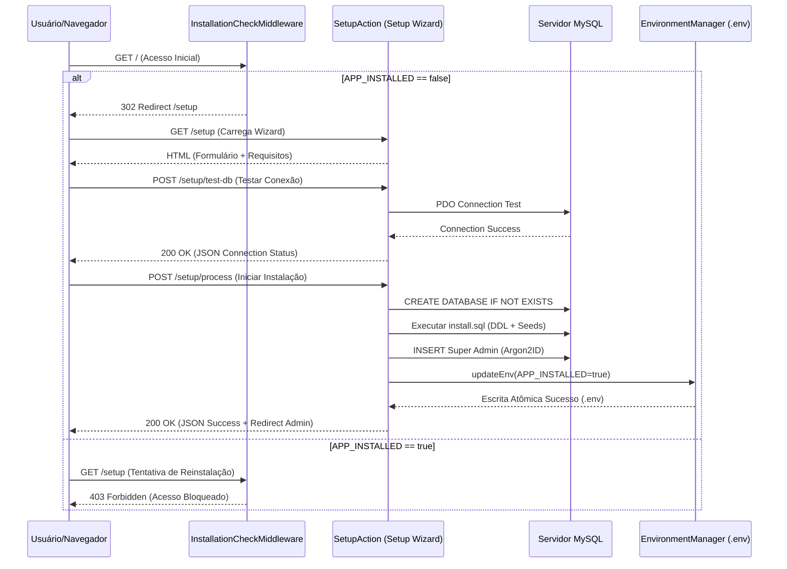

# Especificação Técnica de Provisionamento de Tenants (SaaS Onboarding & Setup)

- **Contexto:** Automação de Onboarding de Tenants (SaaS) e Instalação em Servidor Zeros-State.
- **Estratégia de Isolamento:** Database-per-Tenant (Isolamento Físico Recomendado).
- **Gestão de Estado:** Variáveis de Ambiente (`.env`) via `APP_INSTALLED` e `EnvironmentManager`.

---

## 1. Protocolo de Integração & Fluxo de Execução

-0. **Pré-requisitos e Diagnóstico de Ambiente**:
   - Antes da instalação, o ambiente pode ser validado via terminal com `./scripts/check_requirements.sh`.
   - A matriz completa de requisitos de sistema, extensões e permissões está documentada em [requirements.md](file:///var/www/html/agsonhos/docs/instalation/requirements.md).

0. **Verificação de Autoload (`vendor/autoload.php`)**:
   - Antes do boot, o `index.php` verifica se a pasta `vendor/` existe. Caso esteja ausente (ex: novo clone por alunos/devs sem rodar o Composer), tenta disparar `exec('composer install')` automaticamente.
   - Caso o servidor web restrinja `exec()`, exibe uma tela amigável nativa em HTML puro orientando a execução de `composer install` no terminal.

0.1 **Auto-Criação e Permissões da Pasta `storage/`**:
   - Em [config.php](file:///var/www/html/agsonhos/config.php), o sistema verifica a existência e permissão da pasta `storage/` e subpastas (`cache/`, `cache/twig_slim/`, `cache/twig_setup/`, `cache/alpha_proxies/`, `download/`, `logs/`, `session/`, `upload/`).
   - Se algum diretório não existir, o sistema tenta criá-lo automaticamente via `@mkdir($path, 0777, true)` e ajusta as permissões com `@chmod($path, 0777)`.
   - Se a permissão não puder ser ajustada (ex: restrição do sistema operacional), é exibida uma tela HTML estilizada em dark mode indicando a rota exata e a instrução `chmod -R 775 storage/`.

1. **Intercepção Global (`InstallationCheckMiddleware`)**:
   - Se `APP_INSTALLED=false`: Redireciona qualquer requisição HTTP pública para o assistente `/setup`. Desvia o boot de conexões com banco de dados para evitar exceções antes da criação das tabelas.
   - Se `APP_INSTALLED=true`: Inicializa normalmente a Alpha Engine e bloqueia qualquer tentativa de acesso ao `/setup` com `403 Forbidden`.

2. **Validação de Requisitos & Conexão MySQL**:
   - Checagem automática de versão do PHP ($\ge 8.1$), extensões (`pdo_mysql`, `mbstring`, `gd`), permissão de gravação no arquivo `.env` e pasta `storage/`.
   - Rota AJAX `/setup/test-db` para teste instantâneo de conectividade com o servidor MySQL antes de iniciar a gravação.

3. **Pipeline de Provisionamento**:
   - **Banco de Dados**: `CREATE DATABASE IF NOT EXISTS \`dbname\` CHARACTER SET utf8mb4 COLLATE utf8mb4_unicode_ci`.
   - **Migração & Carga Inicial**: Importação do esquema consolidado DDL e Seeds (`resources/schema/install.sql`).
   - **Super Administrador**: Criação do usuário admin com hash de senha `PASSWORD_ARGON2ID`.

4. **Escrita Atômica do Arquivo `.env`**:
   - A classe `Alpha\Support\EnvironmentManager` realiza a gravação em arquivo temporário (`.env.tmp`) com trava exclusiva (`LOCK_EX`) e substituição atômica (`rename`), aplicando permissões restritas (`0640`).
   - Alteração programática da flag para `APP_INSTALLED=true` e geração de chaves secretas aleatórias (`JWT_SECRET_KEY`, `API_SIGNATURE_SECRET`).

---

## 2. Estrutura de Automação (YAML)

```yaml
tenant_provisioning:
  strategy: "Database-per-Tenant"
  persistence: "MySQL"
  state_management:
    method: "EnvironmentVariables"
    source: ".env"
    state_flag: "APP_INSTALLED"
    lock_mode: "LOCK_EX"
  security_policy:
    file_permissions: "0640"
    middleware_check: "Alpha\\Auth\\Middleware\\InstallationCheckMiddleware"
    password_hash: "PASSWORD_ARGON2ID"
  execution_pipeline:
    - step: 1
      action: "check_server_requirements"
      abort_on_fail: true
    - step: 2
      action: "validate_mysql_credentials"
      route: "/setup/test-db"
    - step: 3
      action: "create_tenant_database"
      charset: "utf8mb4_unicode_ci"
    - step: 4
      action: "import_schema_and_seeds"
      source: "resources/schema/install.sql"
    - step: 5
      action: "create_super_admin"
      algorithm: "ARGON2ID"
    - step: 6
      action: "persist_atomic_env_config"
      set_installed_flag: true
```

---

## 3. Fluxo de Sequência (Mermaid)



---

## Directrizes de Segurança & Hardening

* **Idempotência:** Toda execução de criação de banco ou tabela usa `CREATE DATABASE IF NOT EXISTS` e `DROP TABLE IF EXISTS` nos arquivos de migração.
* **Isolamento:** O estado `APP_INSTALLED` é a *Single Source of Truth* do estado da aplicação.
* **Sanitização de `.env`:** Valores de variáveis com caracteres especiais ou aspas são automaticamente escapados para prevenir erros de parsing no Dotenv.
