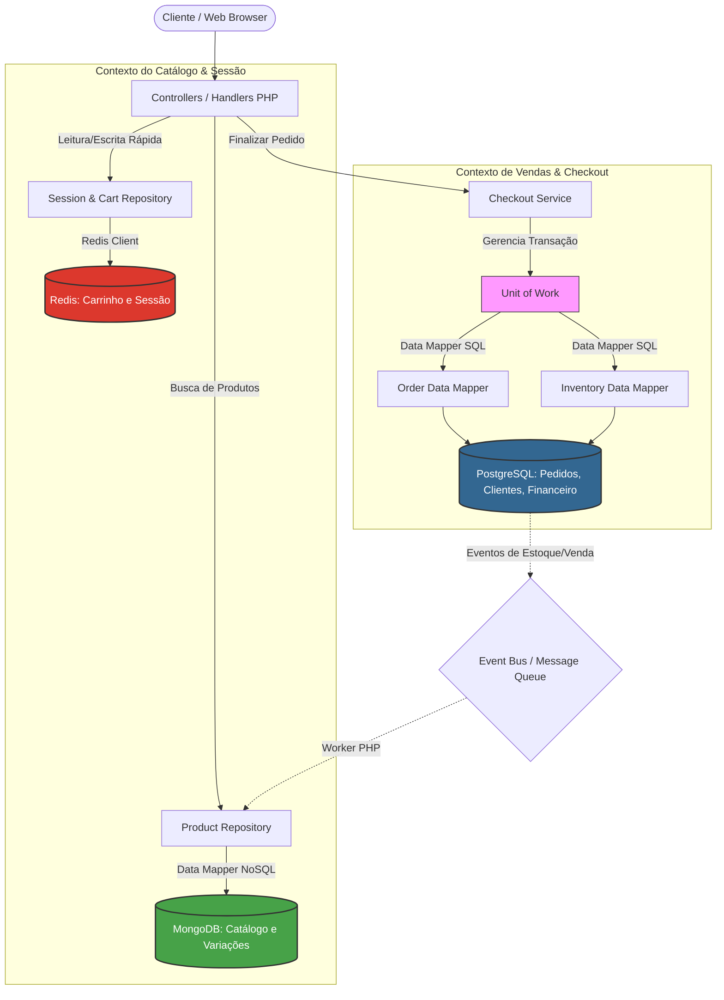

# 📂 Boas Práticas no Uso conjunto de Bancos de Dados

> Para uma aplicação de e-commerce construída do zero, começar com a arquitetura certa poupará meses de refatoração no futuro. A abordagem moderna mais eficiente não tenta resolver tudo com um único banco de dados, mas utiliza uma estratégia chamada Polyglot Persistence (Persistência Poliglota), onde cada banco cuida do que faz de melhor.
Abaixo estão os conselhos e as melhores práticas divididos por categoria e fluxo de dados.
------------------------------
## 1. O Core da Arquitetura: A Divisão de Responsabilidades
Para um e-commerce do zero, a divisão ideal de bancos de dados segue este modelo:
## Catálogo de Produtos e Busca ➔ MongoDB + Search Engine

* Conselho: Coloque todo o seu catálogo de produtos (incluindo categorias, avaliações e variações) no MongoDB.
* Boa prática: Evite normalizar os dados como se fosse um banco SQL. Em vez de criar uma coleção para "Produtos" e outra para "Variantes", incorpore as variantes dentro do documento do produto como um array.
* Evolução: À medida que o e-commerce crescer, adicione um mecanismo de busca como Elasticsearch ou OpenSearch (ou use o MongoDB Atlas Search) acima do MongoDB para lidar com buscas textuais complexas, filtros por facetas (ex: cor, tamanho, preço ao mesmo tempo) e correções ortográficas automáticas.

## Checkout, Estoque e Financeiro ➔ Banco Relacional (PostgreSQL / MySQL)

* Conselho: Toda transação financeira, regras de cupom de desconto, saldo de carteira e controle estrito de estoque precisam estar em um banco SQL.
* Boa prática: Use o isolamento transacional do SQL para garantir que, se houver apenas 1 unidade de um produto em estoque, dois clientes não consigam comprá-lo simultaneamente. Se a escrita falhar no banco de dados na hora de debitar o estoque, a compra deve ser cancelada imediatamente (Rollback).

## Sessão, Carrinho e Cache de Performance ➔ Redis

* Conselho: Carrinhos de compras abandonados ou ativos não devem sobrecarregar o banco de dados principal. Use o Redis para armazenar os itens do carrinho e as sessões dos usuários logados.
* Boa prática: Configure um tempo de expiração (TTL - Time to Live) nos carrinhos no Redis (por exemplo, 7 dias). Se o usuário não finalizar a compra, o Redis apaga o dado sozinho, limpando a memória do servidor automaticamente.

------------------------------
## 2. Boas Práticas Específicas para o MongoDB (Catálogo)
Como você usará o MongoDB para a parte mais dinâmica (o catálogo), siga estas regras de modelagem de dados:

* Regra dos 16MB: Um único documento JSON no MongoDB não pode passar de 16MB. Guardar variações e dados técnicos de um produto dentro dele é seguro. Porém, nunca guarde as avaliações (reviews) dos clientes infinitamente dentro do documento do produto. Se um produto viralizar e receber 100 mil comentários, o documento vai estourar o limite. Contorne isso criando uma coleção separada chamada reviews com uma referência ao id_produto.
* Crie Índices Estratégicos: O MongoDB é extremamente rápido, desde que você indexe os campos mais buscados. Garanta índices para campos como slug (a URL amigável do produto), categorias e sku.
* Evite o antipadrão de JOINs ($lookup): Se você precisar usar muitos operadores $lookup para juntar coleções no MongoDB a cada clique do usuário, sua modelagem está errada (provavelmente simulando um banco SQL). O dado deve nascer pronto para ser consumido pela interface do usuário.

------------------------------
## 3. Estratégias de Sincronização entre os Bancos
O maior desafio de usar mais de um banco de dados é mantê-los conversando sem gerar inconsistências (ex: o produto mudou de nome no catálogo do MongoDB, mas o relatório financeiro do SQL ainda puxa o nome antigo).

* Use IDs Únicos Universais (UUID): Nunca use IDs sequenciais (1, 2, 3...) para cruzar informações entre sistemas. Use UUIDs ou a própria ObjectId do MongoDB. Quando o banco SQL registrar a venda, ele deve gravar o UUID do produto que veio do MongoDB.
* Event-Driven Architecture (Arquitetura Baseada em Eventos): No início, sua aplicação pode salvar diretamente no MongoDB e no SQL através do código da API. Conforme a aplicação cresce, adicione um mensageiro como RabbitMQ ou Kafka. Quando um produto for comprado no SQL, um evento "EstoqueAtualizado" é disparado, e o MongoDB atualiza a informação de disponibilidade no catálogo de forma assíncrona.

------------------------------
## Resumo do MVP (Produto Mínimo Viável)
Se você está começando sozinho ou com uma equipe pequena, simplifique no primeiro mês:

   1. Comece com PostgreSQL para a estrutura de usuários/vendas e MongoDB para o catálogo de produtos.
   2. Deixe o Redis e ferramentas de busca complexas para uma segunda etapa, quando o volume de acessos exigir essa otimização.

## 📤 Diagrama de Arquitetura (Mermaid)
Este diagrama exemplifica como as requisições do cliente entram na sua aplicação PHP e como os padrões de projeto gerenciam o fluxo de dados para cada banco:

## Como os padrões de projeto (Martin Fowler) se aplicam aqui:

   1. **Data Mapper (Mapeador de Dados):**
Diferente do Active Record (onde a própria classe da entidade sabe como se salvar no banco), o Data Mapper isola completamente suas entidades de domínio (Product, Order) dos mecanismos de banco de dados.
   * Você terá um ProductDataMapper que sabe como converter uma entidade pura do PHP em um documento BSON para o MongoDB.
   * Você terá um OrderDataMapper que traduz a entidade Order em querys INSERT estruturadas para o SQL.
   * Suas entidades de negócio continuam sendo PHP puro (POPOs - Plain Old PHP Objects), fáceis de testar.
   2. **Repository (Repositório):**
   Atua como uma coleção em memória de objetos de domínio. O seu ProductRepository encapsula o ProductDataMapper. O Controller apenas pede $productRepository->findById($id), sem fazer ideia se o dado está vindo do MongoDB, de um arquivo JSON ou de uma API externa.
   3. **Unit of Work (Unidade de Trabalho):**
   Essencial para o seu contexto relacional (SQL). O Unit of Work rastreia tudo o que mudou durante uma requisição de negócio (por exemplo: um novo pedido foi criado e o estoque de 3 produtos foi alterado). Ao final da transação, ele abre uma única transação SQL, envia todas as alterações de uma vez e faz o commit. Se algo falhar, ele faz o rollback, mantendo o banco financeiro 100% íntegro.
   4. **Identity Map (Mapa de Identidade):**
   Implementado dentro dos seus Mappers ou Repositórios para garantir que o mesmo registro não seja carregado do banco de dados mais de uma vez durante a mesma requisição. Se o código chamar o produto XYZ três vezes no mesmo script, o Identity Map devolve a mesma instância em memória a partir da segunda chamada, economizando conexões ao MongoDB ou SQL.

Se quiser aprofundar na implementação em código puro, o que prefere ver primeiro:

* A estrutura de código de um Data Mapper para o MongoDB lidando com o documento de produto e suas variantes?
* A implementação do padrão Unit of Work em PHP gerenciando a transação de estoque no banco SQL?

