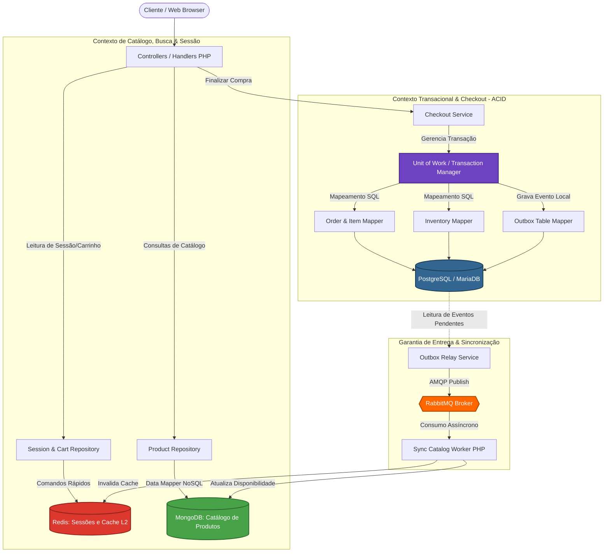

# 📂 Boas Práticas na Arquitetura de Persistência Poliglota (SQL + MongoDB + Redis)

> **Guia de Engenharia de Software e Modelagem de Dados para E-commerce de Alta Performance**  
> Para uma aplicação de e-commerce moderna, projetar a arquitetura de dados correta desde o início poupa meses de refatoração crítica. A estratégia canônica para sistemas robustos é a **Persistência Poliglota (Polyglot Persistence)**, onde cada motor de banco de dados é empregado estritamente para o que faz de melhor, respeitando os *Bounded Contexts* (Contextos Delimitados) do domínio.

---

## 1. O Core da Arquitetura: A Divisão Estratégica de Responsabilidades

Em uma plataforma de e-commerce, as cargas de trabalho (*workloads*) possuem requisitos completamente opostos: leitura massiva com dados polimórficos no catálogo vs. consistência transacional estrita (ACID) no checkout e financeiro.

```
┌─────────────────────────────────────────────────────────────────────────────┐
│                            PERSISTÊNCIA POLIGLOTA                           │
├─────────────────────┬───────────────────────────────┬───────────────────────┤
│    Catálogo & Busca │    Transacional & Estoque     │ Sessão, Carrinho & L2 │
├─────────────────────┼───────────────────────────────┼───────────────────────┤
│       MongoDB       │    PostgreSQL / MariaDB       │         Redis         │
│  (Document / NoSQL) │         (Relacional)          │      (In-Memory)      │
│                     │                               │                       │
│ • Schemas dinâmicos │ • Transações ACID rigorosas   │ • Sessões com TTL     │
│ • Variações / SKUs  │ • Estoque e reserva atômica   │ • Carrinhos voláteis  │
│ • Busca facetada    │ • Pedidos, Notas Fiscais      │ • Rate limiting       │
│ • Alta vazão leitura│ • Ledger financeiro e Cupons  │ • Cache de consultas  │
└─────────────────────┴───────────────────────────────┴───────────────────────┘
```

### 1.1 Catálogo de Produtos e Busca ➔ MongoDB + Search Engine
* **Responsabilidade:** Armazenar o catálogo completo de produtos, fichas técnicas, variações (cores, tamanhos, voltagens), marcas e árvores de categorias.
* **Por que NoSQL documental:** Produtos de e-commerce são altamente polimórficos. Uma camiseta tem `tamanho` e `tecido`; uma geladeira tem `voltagem`, `capacidade_litros` e `consumo_kwh`. Modelar isso em SQL exige antipadrões como *Entity-Attribute-Value (EAV)* ou dezenas de tabelas de junção (*JOIN hell*), o que degrada a performance de leitura.
* **Evolução de Busca:** Para busca com tolerância a erros de digitação (*fuzzy search*), sinônimos e relevância ponderada por pontuação (*score*), utilize o **MongoDB Atlas Search** (baseado em Apache Lucene) ou integre uma engine dedicada como **OpenSearch / Elasticsearch**.

### 1.2 Checkout, Estoque e Financeiro ➔ Banco Relacional (PostgreSQL / MariaDB)
* **Responsabilidade:** Processamento de pedidos (*orders*), regras de checkout, controle de saldo e reservas de estoque, transações financeiras, conciliação e cupons de desconto.
* **Garantia ACID:** Se há apenas 1 unidade de um item em estoque, duas compras simultâneas não podem ser autorizadas sob hipótese alguma. Bancos relacionais com isolamento transacional (*READ COMMITTED* ou *SERIALIZABLE*) e bloqueio pessimista (`SELECT ... FOR UPDATE`) garantem que a consistência matemática e fiscal seja inviolável. Em caso de falha de gravação ou pagamento recusado, o `ROLLBACK` anula atomicamente todas as alterações.

### 1.3 Sessão, Carrinho e Cache de Performance ➔ Redis
* **Responsabilidade:** Armazenamento de sessões ativas de usuários, carrinhos de compras em andamento, limites de requisição (*rate limiting*) e cache de segundo nível (L2) de consultas frequentes do catálogo.
* **Ciclo de Vida Efêmero (TTL):** Carrinhos abandonados e tokens de sessão expirados não devem ocupar espaço permanente no banco relacional ou documental. O Redis gerencia expiração automática via **TTL (Time to Live)** de forma nativa (ex: 7 dias para carrinhos de visitantes). Além disso, sua execução 100% em memória RAM entrega respostas em microssegundos.

### 1.4 A Regra de Ouro do E-commerce: Snapshots Imutáveis de Pedidos
> [!IMPORTANT]
> **Nunca confie em referências vivas ao catálogo para exibir pedidos concluídos.**
> Quando um cliente finaliza um pedido, o banco relacional **NÃO** deve apenas armazenar o `product_id` e consultar o MongoDB para exibir o nome e o preço no histórico de compras.
> Se o lojista alterar o título do produto de "Cadeira Gamer Preta" para "Cadeira Ergonômica Azul" e o preço subir de R$ 800 para R$ 1.200, os pedidos passados seriam corrompidos, violando obrigações fiscais e de auditoria.
> 
> **Boas Práticas:**
> A tabela relacional `order_items` deve gravar uma **cópia imutável (snapshot)** no momento exato do checkout contendo: `product_id` (UUID), `sku`, `title`, `unit_price`, `applied_discounts`, `tax_details` e um JSON com os atributos adquiridos (`selected_variant`).

---

## 2. Modelagem Avançada de Dados no MongoDB (Catálogo)

Modelar para MongoDB não é simplesmente salvar o JSON da API. O schema deve ser projetado com base nos **padrões de acesso da interface do usuário (UI)**.

### 2.1 Embedding (Incorporação) vs. Referencing (Referência)
A decisão entre embutir (*embed*) ou referenciar (*reference*) segue regras matemáticas claras de cardinalidade:

| Cardinalidade | Exemplo de Negócio | Estratégia Recomendada | Justificativa |
| :--- | :--- | :--- | :--- |
| **1 : 1** | Produto ➔ Dimensões de Frete | **Embed** | Sempre consultados juntos; evita consultas adicionais. |
| **1 : Poucos** | Produto ➔ Variantes / SKUs / Imagens | **Embed** | O número de variantes raramente passa de 50. Carregamento em uma única operação. |
| **1 : Muitos** | Produto ➔ Avaliações / Perguntas | **Híbrido (Subset)** | Avaliações podem crescer indefinidamente; risco de violar o limite de 16MB. |
| **1 : Milhões** | Produto ➔ Histórico de Preços / Logs de Visualização | **Referência Inversa** | O registro filho guarda o `product_id` em coleção dedicada; nunca embutir no pai. |

### 2.2 Padrões de Design de Schema (Design Patterns)

#### Padrão 1: Attribute Pattern (Atributos Heterogêneos)
**Problema:** Em um catálogo com milhares de categorias, criar campos fixos na raiz do documento (`cor`, `voltagem`, `tamanho_tela`, `memoria_ram`) torna os documentos esparsos e exige a criação de centenas de índices individuais no MongoDB.

**Solução:** Normalize os atributos dinâmicos em um array de pares chave/valor:

```json
{
  "_id": "018e3a2b-7c1e-7f32-8df2-36c57f5c9001",
  "sku_parent": "NOTE-DELL-G15",
  "title": "Notebook Gamer Dell G15",
  "status": "ACTIVE",
  "attributes": [
    { "k": "brand", "v": "Dell" },
    { "k": "processor", "v": "Intel Core i7-13650HX" },
    { "k": "ram", "v": "16GB", "unit": "GB" },
    { "k": "storage", "v": "512GB", "unit": "GB" },
    { "k": "gpu", "v": "NVIDIA RTX 4050" }
  ],
  "variants": [
    {
      "sku": "NOTE-DELL-G15-16GB-GRAY",
      "price": 5499.00,
      "barcode": "7891234567890",
      "options": { "color": "Grafite", "voltage": "Bivolt" }
    }
  ]
}
```
* **Vantagem:** Com apenas **um índice composto** (`{ "attributes.k": 1, "attributes.v": 1 }`), o MongoDB indexa todos os filtros possíveis do catálogo sem estourar o limite de índices da coleção.

#### Padrão 2: Subset Pattern (Avaliações e Mídias sem Estourar 16MB)
> [!CAUTION]
> **A Regra dos 16MB:** O BSON do MongoDB impõe um limite máximo de 16 megabytes por documento. Nunca embuta listas abertas (*unbounded arrays*) como comentários ou histórico de auditoria dentro do documento principal.

**Solução:** O documento do produto guarda dados consolidados e apenas o subconjunto que a tela inicial precisa exibir:

```json
{
  "_id": "018e3a2b-7c1e-7f32-8df2-36c57f5c9001",
  "title": "Notebook Gamer Dell G15",
  "review_summary": {
    "rating_average": 4.8,
    "rating_count": 1420,
    "five_star_count": 1150
  },
  "top_reviews": [
    {
      "review_id": "018e3a35-1a2b-7c3d-8e4f-5a6b7c8d9e0f",
      "author_name": "Carlos M.",
      "rating": 5,
      "summary": "Excelente desempenho em jogos pesados.",
      "created_at": "2026-08-10T14:22:00Z"
    }
  ]
}
```
* O histórico completo de avaliações fica na coleção `reviews`, paginado sob demanda (`db.reviews.find({ product_id: ... }).sort({ created_at: -1 }).skip(20).limit(20)`).

### 2.3 Estratégias de Indexação e Regra ESR (Equality, Sort, Range)
A performance do MongoDB depende diretamente da correspondência exata dos seus índices compostos com a regra **ESR**:
1. **Equality (`=`):** Campos filtrados por valor exato primeiro (ex: `status: "ACTIVE"`, `category_id: "..."`).
2. **Sort (Ordenação):** Campos usados na cláusula `sort` (ex: `price: 1` ou `created_at: -1`).
3. **Range (`>`, `<`, `$in`):** Campos com comparações de intervalo no final (ex: `price: { $gte: 1000, $lte: 5000 }`).

```javascript
// Exemplo de criação de índices recomendados no mongosh
db.products.createIndex({ "slug": 1 }, { unique: true });
db.products.createIndex({ "category_id": 1, "status": 1, "created_at": -1 });
db.products.createIndex({ "attributes.k": 1, "attributes.v": 1 });
db.products.createIndex({ "variants.sku": 1 }, { unique: true });
```

### 2.4 Validação de Schema em Nível de Coleção (`$jsonSchema`)
Mesmo sendo NoSQL (*schemaless* por padrão), em um ambiente de produção o banco não deve aceitar dados corrompidos. Use a validação nativa do MongoDB:

```javascript
db.createCollection("products", {
  validator: {
    $jsonSchema: {
      bsonType: "object",
      required: ["_id", "title", "slug", "status", "variants"],
      properties: {
        _id: { bsonType: "string" }, // UUIDv7
        title: { bsonType: "string", description: "Obrigatório e deve ser texto" },
        slug: { bsonType: "string", pattern: "^[a-z0-9]+(?:-[a-z0-9]+)*$" },
        status: { enum: ["DRAFT", "ACTIVE", "ARCHIVED"] },
        variants: {
          bsonType: "array",
          minItems: 1,
          description: "Produto deve ter ao menos 1 variante"
        }
      }
    }
  }
});
```

### 2.5 Controle de Concorrência Otimista (Optimistic Locking)
Ao atualizar produtos no painel administrativo, evite sobreposições de salvamento (*lost updates*) mantendo um campo numérico de versão (`version`):

```javascript
// Query de atualização com verificação atômica de versão
db.products.updateOne(
  { _id: "018e3a2b-7c1e-7f32-8df2-36c57f5c9001", version: 3 },
  {
    $set: { title: "Novo Título Atualizado" },
    $inc: { version: 1 }
  }
);
// Se matchedCount == 0, ocorreu concorrência; a aplicação deve lançar OptimisticLockException.
```

---

## 3. Sincronização e Consistência entre Bancos

O desafio central da persistência poliglota é manter a coerência de dados entre os bancos sem criar acoplamento rígido ou falhas parciais.

### 3.1 O Problema do Dual-Write (Por que NUNCA fazer na API)
> [!WARNING]
> **Antipadrão Crítico:** Executar salvamentos sequenciais no controller ou service da aplicação:
> ```php
> // ANTIPADRÃO NÃO RECOMENDADO:
> $this->sqlOrderRepository->save($order);     // Gravou no SQL com sucesso!
> $this->mongoCatalogRepository->updateStock($sku); // FALHOU (Timeout de rede ou crash da máquina)
> ```
> O resultado é um **estado inconsistente**: o pedido foi criado, mas o catálogo no MongoDB continua mostrando o estoque anterior. Transações distribuídas de duas fases (2PC/XA) são lentas e frágeis em ambientes distribuídos modernos.

### 3.2 Identificadores Universais: Por que Adotar UUIDv7
Nunca utilize IDs auto-incrementais (`1, 2, 3...`) para cruzar dados entre bancos distintos.
* **Por que não sequenciais:** Provocam colisão de IDs entre ambientes, revelam métricas comerciais via URLs e impedem a geração prévia do ID na aplicação.
* **Por que não ObjectId puro do MongoDB:** O `ObjectId` é exclusivo do ecossistema MongoDB e pouco natural em tabelas relacionais do SQL.
* **A Recomendação Canônica: UUIDv7:**
  - O **UUIDv7** (RFC 9562) é ordenado temporalmente (*time-ordered*) nos primeiros bits.
  - Oferece excelente desempenho em índices **B-Tree** do PostgreSQL/MariaDB (evita fragmentação de páginas de disco gerada pelo UUIDv4 aleatório).
  - É gerado diretamente pelo backend PHP antes de qualquer persistência, servindo de chave comum entre SQL, MongoDB e Redis.

### 3.3 A Solução: Transactional Outbox Pattern com RabbitMQ
A forma mais confiável e testada em escala para sincronizar bancos heterogêneos sem perda de dados é o **Transactional Outbox Pattern**:

```
Fluxo Transacional com Outbox:

1. [Cliente] ── Finalizar Pedido ──> [CheckoutService]
                                            │
                                            ▼
                    ┌───────────────────────────────────────────────┐
                    │ Transação Atômica ACID (PostgreSQL / MariaDB) │
                    │ 1. INSERT INTO orders (...)                   │
                    │ 2. UPDATE inventory SET stock = stock - 1     │
                    │ 3. INSERT INTO outbox_events (                │
                    │      event_type: 'OrderPlaced',               │
                    │      payload: { ... }, status: 'PENDING'      │
                    │    )                                          │
                    │ COMMIT;                                       │
                    └───────────────────────────────────────────────┘
                                            │
                                            ▼
                             [Outbox Relay / Worker PHP]
                                            │
                                  Publica mensagem
                                            ▼
                               [Message Broker: RabbitMQ]
                                            │
                                            ▼
                                [Catalog Sync Consumer]
                                            │
                                            ▼
                                  [MongoDB: Catálogo]
                         (Atualiza flag "in_stock" e variantes)
```

1. Na mesma transação SQL que debita o estoque e grava o pedido, grava-se uma linha na tabela `outbox_events`.
2. Como a gravação da outbox ocorre dentro da transação local do banco relacional, **é garantido** que o evento só existe se o pedido for commitado.
3. Um processo em segundo plano (*Outbox Relay / Debezium CDC*) lê a tabela e publica no **RabbitMQ**.
4. Um consumidor (*Worker*) lê do RabbitMQ e atualiza as informações necessárias no **MongoDB** ou invalida chaves no **Redis** de forma assíncrona, tolerante a falhas e com idempotência.

---

## 4. Diagrama de Arquitetura da Solução (Mermaid)

Este diagrama representa o fluxo unificado de dados em uma arquitetura limpa com Persistência Poliglota:



---

## 5. Implementação Prática em PHP 8.2+ (Clean Architecture)

Abaixo estão os padrões concretos de código para integrar o MongoDB respeitando o isolamento entre camadas de Domínio e Infraestrutura presentes no projeto.

### 5.1 Interface de Domínio: `ProductRepositoryInterface`
O domínio define o contrato puro sem acoplamento a bibliotecas externas:

```php
<?php

declare(strict_types=1);

namespace App\Domain\Catalog\Repositories;

use App\Domain\Catalog\Entities\Product;

interface ProductRepositoryInterface
{
    public function findById(string $id): ?Product;
    public function findBySlug(string $slug): ?Product;
    public function save(Product $product): void;
    public function delete(string $id): void;
}
```

### 5.2 O Data Mapper: `MongoProductDataMapper`
Responsável pela tradução bidirecional entre o Objeto de Domínio e o documento BSON/Array do MongoDB:

```php
<?php

declare(strict_types=1);

namespace App\Infrastructure\Persistence\Mappers;

use App\Domain\Catalog\Entities\Product;
use App\Domain\Catalog\ValueObjects\Money;
use App\Domain\Catalog\ValueObjects\Variant;

class MongoProductDataMapper
{
    /**
     * Converte Documento MongoDB (Array BSON) em Entidade de Domínio
     */
    public function toDomain(array $document): Product
    {
        $variants = array_map(function (array $variantDoc): Variant {
            return new Variant(
                sku: $variantDoc['sku'],
                price: new Money((float) $variantDoc['price'], $variantDoc['currency'] ?? 'BRL'),
                options: $variantDoc['options'] ?? []
            );
        }, $document['variants'] ?? []);

        return new Product(
            id: (string) $document['_id'],
            title: (string) $document['title'],
            slug: (string) $document['slug'],
            status: (string) $document['status'],
            variants: $variants,
            version: (int) ($document['version'] ?? 1)
        );
    }

    /**
     * Converte Entidade de Domínio em Documento BSON para o MongoDB
     */
    public function toDocument(Product $product): array
    {
        $variants = array_map(function (Variant $variant): array {
            return [
                'sku' => $variant->getSku(),
                'price' => $variant->getPrice()->getAmount(),
                'currency' => $variant->getPrice()->getCurrency(),
                'options' => $variant->getOptions(),
            ];
        }, $product->getVariants());

        return [
            '_id' => $product->getId(),
            'title' => $product->getTitle(),
            'slug' => $product->getSlug(),
            'status' => $product->getStatus(),
            'variants' => $variants,
            'version' => $product->getVersion(),
            'updated_at' => new \MongoDB\BSON\UTCDateTime(),
        ];
    }
}
```

### 5.3 Implementação do Repositório: `MongoProductRepository`
Utiliza a biblioteca oficial `mongodb/mongodb` mantendo o controle otimista de versão:

```php
<?php

declare(strict_types=1);

namespace App\Infrastructure\Persistence\Repositories;

use App\Domain\Catalog\Entities\Product;
use App\Domain\Catalog\Exceptions\OptimisticLockException;
use App\Domain\Catalog\Repositories\ProductRepositoryInterface;
use App\Infrastructure\Persistence\Mappers\MongoProductDataMapper;
use MongoDB\Collection;

class MongoProductRepository implements ProductRepositoryInterface
{
    public function __construct(
        private readonly Collection $collection,
        private readonly MongoProductDataMapper $mapper
    ) {}

    public function findById(string $id): ?Product
    {
        $document = $this->collection->findOne(['_id' => $id]);
        if ($document === null) {
            return null;
        }

        return $this->mapper->toDomain((array) $document);
    }

    public function findBySlug(string $slug): ?Product
    {
        $document = $this->collection->findOne(['slug' => $slug, 'status' => 'ACTIVE']);
        if ($document === null) {
            return null;
        }

        return $this->mapper->toDomain((array) $document);
    }

    public function save(Product $product): void
    {
        $document = $this->mapper->toDocument($product);
        $currentVersion = $product->getVersion();

        $result = $this->collection->updateOne(
            ['_id' => $product->getId(), 'version' => $currentVersion],
            [
                '$set' => array_diff_key($document, ['_id' => true, 'version' => true]),
                '$inc' => ['version' => 1]
            ],
            ['upsert' => $currentVersion === 1]
        );

        if ($result->getMatchedCount() === 0 && $result->getUpsertedCount() === 0) {
            throw new OptimisticLockException(
                "O produto {$product->getId()} foi modificado por outro processo concorrente."
            );
        }
    }

    public function delete(string $id): void
    {
        $this->collection->deleteOne(['_id' => $id]);
    }
}
```

### 5.4 Registro no Container de Injeção de Dependências (PHP-DI)
No arquivo de configuração de dependências (`backend/config/container.php`):

```php
use App\Domain\Catalog\Repositories\ProductRepositoryInterface;
use App\Infrastructure\Persistence\Repositories\MongoProductRepository;
use MongoDB\Client as MongoClient;

return [
    MongoClient::class => function () {
        $uri = sprintf(
            'mongodb://%s:%s@%s:%s/%s?authSource=admin',
            $_ENV['MONGO_USERNAME'] ?? 'root',
            $_ENV['MONGO_PASSWORD'] ?? 'secret',
            $_ENV['MONGO_HOST'] ?? 'localhost',
            $_ENV['MONGO_PORT'] ?? '27017',
            $_ENV['MONGO_DATABASE'] ?? 'beta_catalog'
        );
        return new MongoClient($uri);
    },

    ProductRepositoryInterface::class => function (\Psr\Container\ContainerInterface $c) {
        $client = $c->get(MongoClient::class);
        $collection = $client->selectDatabase($_ENV['MONGO_DATABASE'] ?? 'beta_catalog')
                             ->selectCollection('products');
        $mapper = $c->get(\App\Infrastructure\Persistence\Mappers\MongoProductDataMapper::class);

        return new MongoProductRepository($collection, $mapper);
    },
];
```

---

## 6. Checklist de Produção (Production Readiness)

Antes de promover uma arquitetura poliglota para produção, audite os seguintes itens:

* [ ] **Replica Set Ativo:** O MongoDB **deve** operar como Replica Set (mínimo de 3 nós: primário, secundário e árbitro/secundário) mesmo em ambiente de desenvolvimento local, pois recursos como transações e *Change Streams* exigem replica set ativo.
* [ ] **Write Concern 'majority':** Operações críticas no MongoDB devem configurar `writeConcern: { w: 'majority', j: true }` para garantir persistência no disco da maioria dos nós antes da confirmação.
* [ ] **Índices Cobrindo Queries:** Executar `.explain("executionStats")` nas principais consultas de catálogo para garantir que não haja `COLLSCAN` (varredura completa da coleção).
* [ ] **Limpeza de Outbox:** Implementar expiração ou particionamento na tabela `outbox_events` do SQL para remover eventos processados há mais de 30 dias.
* [ ] **Idempotência nos Consumidores:** Garantir que todos os *workers* de mensageria RabbitMQ possam processar o mesmo evento mais de uma vez sem corromper o estado final (*At-Least-Once Delivery*).
* [ ] **Auditoria de Conexões (Connection Pooling):** Manter instâncias únicas (*Singleton*) de clientes de conexão (`MongoClient`, `PDO`, `RedisClient`) gerenciadas pelo container de DI para evitar esgotamento de *file descriptors* e portas no servidor.

---

## 7. Referências Técnicas e Leitura Complementar

1. **Martin Fowler** – *Patterns of Enterprise Application Architecture* (Data Mapper, Repository, Unit of Work, Identity Map).
2. **Martin Kleppmann** – *Designing Data-Intensive Applications* (Partições, Consistência Eventual, Dual-Write e Transações Distribuídas).
3. **MongoDB Official Documentation** – *Building with Patterns: A Summary of Common Schema Design Patterns* (Attribute Pattern, Subset Pattern, Bucket Pattern).
4. **Chris Richardson** – *Microservices Patterns* (Transactional Outbox Pattern e Event-Driven Architecture).
5. **RFC 9562** – *Universally Unique Identifiers (UUIDv7 Specification)*.
