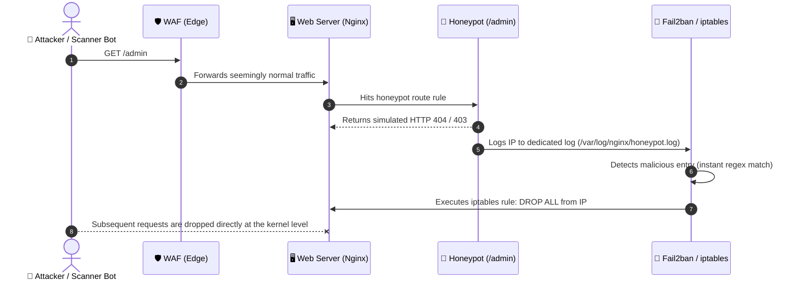

# 🛡️ Defense in Depth: From Edge to Data with Honeypots and Multiple Layers

The classical security maxim often boiled down to a binary choice: either you trust the strength of your password, or you try to hide what is important. In modern internet practice, neither of these isolated approaches survives a targeted attack or automated bot sweeps.

This is where the concept of **Defense in Depth** comes into play.

Originating in military strategy and adapted by information security (championed by agencies such as the NSA and NIST), the core premise is straightforward: **no single security control is infallible.**

Instead of betting on a single insurmountable wall, we build concentric layers of protection. If an attacker breaches the first barrier, they immediately encounter another in front of them. More importantly: the very act of attempting to breach an outer layer triggers alarms and countermeasures that neutralize the aggressor before they reach the core of the system.

> [!TIP]
> **Security through Obscurity vs. Defense in Depth**:
> Changing the dashboard route from `/admin` to `/secret-panel-xyz` as your sole protection is a fallacy (*Security through Obscurity*). However, when obfuscation is combined with an **active Honeypot** and real authentication and network layers, it ceases to be an illusion and becomes an intelligence tool to identify and penalize intruders early on.

---

## 🏛️ The 5-Layer Architecture

Below, we examine how to implement Defense in Depth to protect critical systems and administrative routes, organized from the exterior (perimeter) down to the most valuable asset (data):

```mermaid
graph TD
    Client[🌐 User / Attacker] -->|1. HTTP/HTTPS Request| Layer1[🛡️ Layer 1: Perimeter / Edge<br/>Cloudflare WAF, CDN, Rate Limiting, GeoBlock]
    
    Layer1 -->|Clean Traffic| Layer2[🖥️ Layer 2: Network & Server<br/>Nginx/Apache, Honeypot /admin, Fail2ban]
    Layer1 -- Bot / DDoS Attack --x Drop1[⛔ Edge Drop/Block]
    
    Layer2 -->|Real Secret Route| Layer3[⚙️ Layer 3: Application (PHP)<br/>Obfuscated Route, Security Headers, Debug Disabled]
    Layer2 -- Access to /admin (Honeypot) --> Fail2ban[🚨 Fail2ban / iptables<br/>Automatic IP Ban]
    
    Layer3 -->|Login Screen| Layer4[🔑 Layer 4: Authentication & Access<br/>Argon2id/Bcrypt Hash, 2FA/TOTP, IP/VPN Allowlist]
    
    Layer4 -->|Authenticated| Layer5[🗄️ Layer 5: Data & Auditing<br/>Least Privilege, AES-256 Encryption, Audit Logs]
    Layer4 -- Password / 2FA Failure --> AuditLog[📝 Invalid Attempt Log]
```

---

### 1. Perimeter Layer (Edge)
This is the first line of defense, operating thousands of kilometers away from your application server.

* **WAF (Web Application Firewall):** Analyzes malicious request signatures in real time, blocking SQL injections, Cross-Site Scripting (XSS), Local File Inclusion (LFI) attempts, and known vulnerability scanners (such as sqlmap, Nikto, and Acunetix).
* **CDN and DDoS Mitigation:** Absorbs massive volumetric traffic spikes (L3/L4) and HTTP flood requests (L7), serving cached static assets and preserving your server's resources.
* **Geo-Blocking:** If your application strictly serves a specific country or region (e.g., local commerce or corporate systems), you can drop traffic originating from countries where you have no legitimate users.
* **Edge Rate Limiting:** Prevents a single IP address from making hundreds of requests per second to brute-force routes or exhaust login endpoints.

> [!IMPORTANT]
> **Origin Shielding (Prevent CDN Bypass):**
> Placing a WAF in front is useless if your server's real origin IP remains exposed. Experienced attackers search historical DNS records or scan hosting provider CIDR blocks to hit the origin server directly, bypassing Cloudflare.
> 
> **Best practices:**
> 1. Configure the server firewall (`ufw` or `iptables`) to accept inbound connections on ports `80` and `443` **strictly** from [official Cloudflare IP ranges](https://www.cloudflare.com/ips/).
> 2. Enable **Cloudflare Authenticated Origin Pulls (mTLS)** so that Nginx/Apache only trusts requests signed by the CDN's certificate.

---

### 2. Network & Server Layer (The Active Honeypot Filter)
When a bot or attacker slips past the edge and reaches the web server (Nginx or Apache), the **Honeypot** trap takes over.

Instead of merely returning `404 Not Found` on default routes routinely probed by bots (`/admin`, `/wp-login.php`, `/.env`), we convert that URL into a defensive trigger.

#### How the Honeypot flow works:
1. A bot scans the `/admin` URL looking for exposed administrative dashboards.
2. The web server intercepts the route, returns a dummy response (to avoid giving hints), and writes the IP to a dedicated trap log (`honeypot.log`).
3. **Fail2ban** monitors this log file and, on the very first occurrence, instructs the OS firewall (`iptables` or `nftables`) to **immediately and temporarily ban the IP**.
4. Any subsequent attempt from that IP—even if it attempts to guess the genuine secret route—will never even reach Nginx's port.



#### Practical Configuration Example

**1. In Nginx (`/etc/nginx/sites-available/mysite.conf`):**
```nginx
# Dedicated log exclusively for intruders triggering the trap
location ~* ^/(admin|administrator|wp-login\.php|xmlrpc\.php|\.env)$ {
    access_log /var/log/nginx/honeypot.log combined;
    return 404;
}
```

**2. In Fail2ban Filter (`/etc/fail2ban/filter.d/nginx-honeypot.conf`):**
```ini
[Definition]
failregex = ^<HOST> -.*"(GET|POST|HEAD) /(admin|administrator|wp-login\.php|xmlrpc\.php|\.env) HTTP/.*" 404
ignoreregex =
```

**3. In Fail2ban Jail (`/etc/fail2ban/jail.local`):**
```ini
[nginx-honeypot]
enabled  = true
port     = http,https
filter   = nginx-honeypot
logpath  = /var/log/nginx/honeypot.log
maxretry = 1
bantime  = 86400 ; 24-hour ban on first strike
findtime = 600
```

---

### 3. Application Layer (Obfuscation, Hardening, and Logic)
This is where application source code lives (PHP, Node, Python, Go) alongside routing management and HTTP security.

* **Route Isolation (The real path):** The legitimate administrative route uses a complex, unindexed identifier (e.g., `/internal-mgmt-k89x2/login`).
* **Indexing and Information Leakage Prevention:**
  - **Beware of `robots.txt`:** Never add secret paths to `Disallow: /my-secret-route/` directives. Malicious bots inspect `robots.txt` specifically to catalogue hidden endpoints. Instead, return `X-Robots-Tag: noindex, nofollow` HTTP headers on these pages.
  - **Disable directory listing:** In Apache, use `Options -Indexes`. In Nginx, ensure `autoindex off;` is active.
* **Security Headers:**
  Enforce strict headers to mitigate clickjacking, MIME-sniffing, and cross-site scripting:
  ```http
  Strict-Transport-Security: max-age=31536000; includeSubDomains; preload
  X-Frame-Options: DENY
  X-Content-Type-Options: nosniff
  Referrer-Policy: strict-origin-when-cross-origin
  Content-Security-Policy: default-src 'self'; script-src 'self'; style-src 'self' 'unsafe-inline';
  ```
* **Error Handling and Environment Management (FPD - Full Path Disclosure Prevention):**
  - In **Development**, detailed stack traces are necessary for debugging.
  - In **Production**, errors must never expose database versions, environment variables, or internal paths (`/var/www/html/app/...`).
  - Manage this through environment variables:
    ```ini
    # .env (production)
    APP_ENV=production
    APP_DEBUG=false
    ```
    In production `php.ini`:
    ```ini
    display_errors = Off
    log_errors = On
    error_log = /var/log/php/error.log
    ```

---

### 4. Authentication & Access Control Layer
Even if an attacker uncovers the legitimate route via an accidental leak, they run into an insurmountable barrier of credentials and authentication factors.

* **Secure Password Storage:**
  Use modern hashing algorithms designed to resist GPU and specialized hardware attacks.
  - In PHP, favor `PASSWORD_ARGON2ID` or `PASSWORD_BCRYPT` via `password_hash()`:
    ```php
    // Generate secure hash
    $hash = password_hash($plainPassword, PASSWORD_ARGON2ID, [
        'memory_cost' => 65536,
        'time_cost'   => 4,
        'threads'     => 2
    ]);

    // Verify hash
    if (password_verify($inputPassword, $hash)) {
        // Valid credential
    }
    ```
* **Two-Factor Authentication (2FA / MFA via TOTP):**
  Require a 6-digit Time-based One-Time Password (RFC 6238, compatible with Google Authenticator, FreeOTP, or Bitwarden) or a physical FIDO2/WebAuthn security key. Compromised passwords become useless without the operator's physical device.
* **Application-Level Brute-Force Protection:**
  The application should enforce exponential backoff delays and temporary account lockouts after 5 consecutive incorrect attempts.
* **Network-Level Access Restrictions (Zero Trust / VPN):**
  If the administrative dashboard is intended strictly for internal staff, eliminate public internet access altogether. The dashboard should only respond if requests arrive via:
  1. A private network / VPN (such as WireGuard, Tailscale, or OpenVPN); or
  2. A strict IP allowlist of trusted static addresses.

---

### 5. Data Layer, Auditing, and Least Privilege
The final line of defense assumes the worst-case scenario: what if the application suffers an unforeseen exploit (e.g., a Zero-Day or an RCE/SQLi vulnerability)? The blast radius must be contained and documented.

* **Principle of Least Privilege:**
  - The MySQL/PostgreSQL database user leveraged by the web application must have strictly necessary privileges (`SELECT`, `INSERT`, `UPDATE`, `DELETE`).
  - **Never** run the application under `root` or grant permissions such as `DROP`, `ALTER`, `GRANT`, or file system access (`FILE` in MySQL).
  - Use separate database users for database migration pipelines (CI/CD) versus the application runtime.
* **Encryption at Rest:**
  - Highly sensitive records (third-party API keys, banking tokens, PII subject to GDPR/LGPD regulations) should be encrypted at the database column level using authenticated ciphers like `AES-256-GCM` or `sodium_crypto_secretbox`.
* **Immutable Audit Trails (Audit Logs):**
  - Every critical administrative operation (user provisioning, data deletion, permission modifications) and every authentication failure must produce structured audit logs.
  - These logs must be written outside the webroot (e.g., `/var/log/app/audit.log`) and ideally streamed in real time to a centralized logging server (Syslog, Graylog, Grafana Loki, CloudWatch), ensuring that an attacker compromising the web server cannot erase evidence of the breach.

---

## 📋 Strategic Summary: Defense Matrix

| Layer | Mitigated Attack Vectors | Core Technologies / Practices |
| :--- | :--- | :--- |
| **1. Edge (Perimeter)** | L3/L4/L7 DDoS, vulnerability scanners, scraping bots | Cloudflare WAF, CDN, Geo-Blocking, Rate Limiting, mTLS |
| **2. Network & Server** | Automated scans, directory probing | Nginx / Apache, Honeypot (`/admin`), Fail2ban, iptables/nftables |
| **3. Application** | Route reconnaissance, FPD (Full Path Disclosure), XSS, Clickjacking | Obfuscated route, Security Headers, `APP_ENV=production`, `autoindex off` |
| **4. Authentication** | Credential stuffing, password brute-forcing, session hijacking | Argon2id / bcrypt hash, 2FA (TOTP), HttpOnly/Secure/SameSite Cookies, VPN |
| **5. Data & Auditing** | Mass data exfiltration, log tampering, privilege escalation via DB | Least privilege on DB, AES-GCM / libsodium encryption, External Audit Trail |

---

## 🎯 Conclusion

Information security is not a standalone product you purchase or a single line of code you insert: **it is an architectural mindset.**

By combining intentional obfuscation (a secret route coupled with an aggressive Honeypot) with the robustness of an edge WAF and multi-factor authentication, you shift the asymmetric advantage in favor of the defender. The bot wastes time tripping over the decoy, gets banned at the network layer directly by the Linux kernel, and your core application continues running with stability, confidentiality, and integrity.

---

> Have you implemented Honeypot rules and Fail2ban on your web servers? What has been your experience handling automated scanners and securing critical administrative entry points across your infrastructure?
