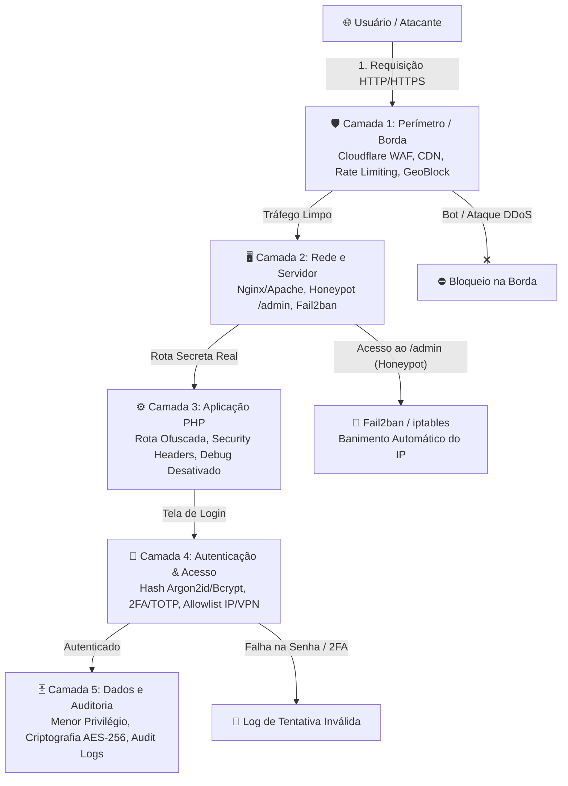
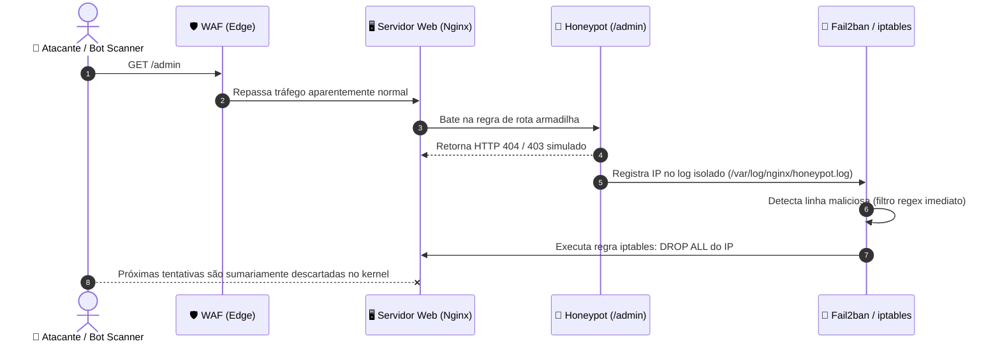

# 🛡️ Proteção em Profundidade: Da Borda aos Dados com Honeypot e Múltiplas Camadas

A máxima da segurança clássica muitas vezes se resumiu a uma escolha binária: ou você confia na força da sua senha, ou tenta esconder o que é importante. Na prática da internet moderna, nenhuma dessas abordagens isoladas sobrevive a um ataque direcionado ou a varreduras automatizadas de bots.

É aqui que entra o conceito de **Defesa em Profundidade (*Defense in Depth*)**.

Originada na estratégia militar e adaptada pela segurança da informação (consagrada por agências como NSA e NIST), a premissa central é direta: **nenhum controle de segurança é infalível.**

Em vez de apostar em um único muro intransponível, construímos camadas concêntricas de proteção. Se o atacante furar a primeira barreira, ele imediatamente encontra outra pela frente. E mais importante: o próprio ato de tentar violar uma camada externa aciona alarmes e contra-ataques que neutralizam o agressor antes que ele alcance o núcleo do sistema.

> [!TIP]
> **Segurança por Obscuridade vs. Defesa em Profundidade**:
> Mudar a rota do painel de `/admin` para `/painel-secreto-xyz` como sua única proteção é uma falácia (*Security through Obscurity*). Porém, quando o ofuscamento é combinado com um **Honeypot ativo** e camadas reais de autenticação e rede, ele deixa de ser uma ilusão e se torna uma ferramenta de inteligência para identificar e punir invasores precocemente.

---

## 🏛️ A Arquitetura das 5 Camadas

Abaixo, analisamos como implementar a Defesa em Profundidade para proteger sistemas e rotas administrativas críticas, organizadas do exterior (perímetro) até o ativo mais valioso (os dados):



---

### 1. Camada de Perímetro (Borda / Edge)
Esta é a primeira linha de defesa, atuando a milhares de quilômetros de distância do teu servidor de aplicação.

* **WAF (Web Application Firewall):** Analisa assinaturas de requisições maliciosas em tempo real, bloqueando injeções de SQL, Cross-Site Scripting (XSS), tentativas de Local File Inclusion (LFI) e scanners de vulnerabilidades conhecidos (como sqlmap, Nikto e Acunetix).
* **CDN e Mitigação DDoS:** Absorve picos massivos de tráfego volumétrico (L3/L4) e requisições HTTP flood (L7), servindo assets estáticos em cache e poupando recursos da sua máquina.
* **Bloqueio Geográfico (Geo-Blocking):** Se sua aplicação atende estritamente a um país ou região (por exemplo, comércio ou sistema corporativo brasileiro), você pode descartar tráfego vindo de países onde não há clientes legítimos.
* **Rate Limiting na Borda:** Impede que um mesmo IP faça centenas de requisições por segundo para forçar rotas ou sobrecarregar endpoints de login.

> [!IMPORTANT]
> **Blindagem da Origem (Evite o bypass da CDN):**
> De nada adianta colocar um WAF na frente se o IP real do teu servidor estiver exposto. Atacantes experientes buscam registros históricos de DNS ou varrem blocos de provedores para bater diretamente no servidor de origem, contornando a Cloudflare.
> 
> **Boas práticas:**
> 1. Configure o firewall do servidor (`ufw` ou `iptables`) para aceitar conexões nas portas `80` e `443` **apenas** a partir dos [blocos de IP oficiais da Cloudflare](https://www.cloudflare.com/ips/).
> 2. Ative o **Cloudflare Authenticated Origin Pulls (mTLS)** para que seu Nginx/Apache confie somente em requisições assinadas pelo certificado da CDN.

---

### 2. Camada de Rede e Servidor (O Filtro do Honeypot Ativo)
Quando um bot ou atacante ultrapassa a borda e chega ao servidor web (Nginx ou Apache), entra em ação a armadilha do **Honeypot**.

Em vez de simplesmente responder `404 Not Found` na rota padrão que todos os bots vasculham (`/admin`, `/wp-login.php`, `/.env`), transformamos esse endereço em um gatilho defensivo.

#### Como funciona o fluxo do Honeypot:
1. Um bot escaneia a URL `/admin` procurando painéis vulneráveis.
2. O servidor web intercepta a rota, devolve uma resposta fictícia (para não dar pistas) e grava o IP em um log dedicado de armadilha (`honeypot.log`).
3. O **Fail2ban** monitora esse arquivo de log e, na primeira ocorrência, instrui o firewall do sistema operacional (`iptables` ou `nftables`) a **banir o IP de forma imediata e temporária**.
4. Qualquer tentativa posterior daquele IP mesmo que ele tente adivinhar a rota secreta real sequer alcançará a porta do Nginx.



#### Exemplo Prático de Configuração

**1. No Nginx (`/etc/nginx/sites-available/meusite.conf`):**
```nginx
# Log dedicado exclusivamente para invasores que caírem na armadilha
location ~* ^/(admin|administrator|wp-login\.php|xmlrpc\.php|\.env)$ {
    access_log /var/log/nginx/honeypot.log combined;
    return 404;
}
```

**2. No Filtro do Fail2ban (`/etc/fail2ban/filter.d/nginx-honeypot.conf`):**
```ini
[Definition]
failregex = ^<HOST> -.*"(GET|POST|HEAD) /(admin|administrator|wp-login\.php|xmlrpc\.php|\.env) HTTP/.*" 404
ignoreregex =
```

**3. Na Jail do Fail2ban (`/etc/fail2ban/jail.local`):**
```ini
[nginx-honeypot]
enabled  = true
port     = http,https
filter   = nginx-honeypot
logpath  = /var/log/nginx/honeypot.log
maxretry = 1
bantime  = 86400 ; Banimento de 24 horas no primeiro deslize
findtime = 600
```

---

### 3. Camada do Aplicativo (Ofuscamento, Hardening e Lógica)
Aqui reside o código-fonte da aplicação (PHP, Node, Python, Go) e a gestão de rotas e segurança HTTP.

* **Isolamento de Rota (O caminho real):** A rota administrativa legítima usa um identificador complexo e não indexável (exemplo: `/gestao-interna-k89x2/login`).
* **Prevenção de Indexação e Vazamento:**
  - **Cuidado com o `robots.txt`:** Nunca adicione caminhos secretos em diretivas `Disallow: /minha-rota-secreta/`. Robôs maliciosos lêem o `robots.txt` justamente para catalogar rotas que você não quer que sejam vistas. Em vez disso, use meta-tags `X-Robots-Tag: noindex, nofollow` nos headers HTTP das respostas dessas páginas.
  - **Desative a listagem de diretórios:** No Apache utilize `Options -Indexes`. No Nginx, garanta que `autoindex off;` esteja ativo.
* **Cabeçalhos de Segurança (Security Headers):**
  Defina cabeçalhos rigorosos para mitigar clickjacking, MIME-sniffing e scripts invasores:
  ```http
  Strict-Transport-Security: max-age=31536000; includeSubDomains; preload
  X-Frame-Options: DENY
  X-Content-Type-Options: nosniff
  Referrer-Policy: strict-origin-when-cross-origin
  Content-Security-Policy: default-src 'self'; script-src 'self'; style-src 'self' 'unsafe-inline';
  ```
* **Tratamento de Erros e Ambientes (Prevenção de FPD - Full Path Disclosure):**
  - Em **Desenvolvimento**, necessitamos de detalhes de stack trace para debug.
  - Em **Produção**, erros nunca devem revelar versões de banco, variáveis de ambiente ou diretórios internos (`/var/www/html/app/...`).
  - Gerencie isso através de variáveis de ambiente:
    ```ini
    # .env (produção)
    APP_ENV=production
    APP_DEBUG=false
    ```
    No `php.ini` de produção:
    ```ini
    display_errors = Off
    log_errors = On
    error_log = /var/log/php/error.log
    ```

---

### 4. Camada de Autenticação e Controle de Acesso
Mesmo que o atacante descubra a rota legítima através de um vazamento acidental, ele se depara com uma barreira intransponível de credenciais e fatores.

* **Armazenamento Seguro de Senhas:**
  Use algoritmos de hashing modernos resistentes a ataques de GPU e hardware especializado.
  - Em PHP, prefira `PASSWORD_ARGON2ID` ou `PASSWORD_BCRYPT` via `password_hash()`:
    ```php
    // Gerar hash seguro
    $hash = password_hash($senhaPura, PASSWORD_ARGON2ID, [
        'memory_cost' => 65536,
        'time_cost'   => 4,
        'threads'     => 2
    ]);

    // Validar hash
    if (password_verify($senhaDigitada, $hash)) {
        // Credencial válida
    }
    ```
* **Segundo Fator de Autenticação (2FA / MFA via TOTP):**
  Exigir um código temporário de 6 dígitos baseado em tempo (RFC 6238, compatível com Google Authenticator, FreeOTP ou Bitwarden) ou chave física FIDO2/WebAuthn. Senhas vazadas tornam-se inúteis sem o dispositivo do operador.
* **Proteção contra Força Bruta na Aplicação:**
  A aplicação deve impor atraso progressivo (*exponential backoff*) e bloqueio de conta após 5 tentativas consecutivas de senha incorreta.
* **Restrição de Acesso por Rede (Zero Trust / VPN):**
  Se o painel for de uso exclusivo da equipe interna, feche o acesso público. O painel só responde se o tráfego vier de:
  1. Uma rede privada/VPN (como WireGuard, Tailscale ou OpenVPN); ou
  2. Uma lista estrita de IPs estáticos confiáveis (*allowlist*).

---

### 5. Camada de Dados, Auditoria e Menor Privilégio
A última linha de defesa assume o pior cenário: e se a aplicação sofrer uma vulnerabilidade inesperada (ex: Zero-Day ou falha de RCE/SQLi)? O estrago precisa ser contido e documentado.

* **Princípio do Menor Privilégio (Least Privilege):**
  - O usuário do MySQL/PostgreSQL utilizado pela aplicação web deve ter permissões estritamente necessárias (`SELECT`, `INSERT`, `UPDATE`, `DELETE`).
  - **Nunca** utilize o usuário `root` ou permissões como `DROP`, `ALTER`, `GRANT`, ou leitura do sistema de arquivos (`FILE` no MySQL) na rotina da aplicação.
  - Tenha usuários de banco distintos para rotinas de migração (CI/CD) e para o runtime da aplicação.
* **Criptografia em Repouso (Encryption at Rest):**
  - Dados ultra-sensíveis (chaves de API de terceiros, tokens bancários, PII - dados pessoais regulados pela LGPD/GDPR) devem ser criptografados na coluna do banco usando algoritmos autenticados como `AES-256-GCM` ou `sodium_crypto_secretbox`.
* **Trilhas de Auditoria Imutáveis (Audit Logs):**
  - Toda ação administrativa crítica (criação de usuário, exclusão de dados, alteração de permissões) e toda falha de autenticação devem gerar logs estruturados.
  - Esses logs devem ser gravados fora do webroot (exemplo: `/var/log/app/audit.log`) e idealmente despachados em tempo real para um servidor centralizado de logs (Syslog, Graylog, Grafana Loki, CloudWatch), garantindo que um atacante que ganhe acesso ao servidor web não consiga apagar as evidências da invasão.

---

## 📋 Resumo Estratégico: Matriz de Defesa

| Camada | Vetores de Ataque Mitigados | Tecnologias / Práticas Principais |
| :--- | :--- | :--- |
| **1. Borda (Perímetro)** | DDoS L3/L4/L7, scanners de vulnerabilidades, bots de scraping | Cloudflare WAF, CDN, Geo-Block, Rate Limiting, mTLS |
| **2. Rede & Servidor** | Varreduras automatizadas, sondagem de diretórios | Nginx / Apache, Honeypot (`/admin`), Fail2ban, iptables/nftables |
| **3. Aplicação** | Reconhecimento de rotas, FPD (Full Path Disclosure), XSS, Clickjacking | Rota ofuscada, Security Headers, `APP_ENV=production`, `autoindex off` |
| **4. Autenticação** | Credential stuffing, força bruta de senhas, sequestro de sessão | Hash Argon2id / bcrypt, 2FA (TOTP), Cookies HttpOnly/Secure/SameSite, VPN |
| **5. Dados & Auditoria** | Vazamento em massa de dados, adulteração de logs, escalada via BD | Menor privilégio no BD, Criptografia AES-GCM / libsodium, Audit Trail externo |

---

## 🎯 Conclusão

A segurança da informação não é um produto que você compra ou uma linha de código que você adiciona: **é um modelo mental de arquitetura.**

Ao combinar o ofuscamento consciente (uma rota secreta aliada a um Honeypot agressivo) com a robustez de um WAF de borda e autenticação de dois fatores, você quebra a assimetria do jogo a favor do defensor. O bot gasta tempo tropeçando na armadilha, é banido no nível de rede pelo kernel do Linux, e sua aplicação central continua operando com estabilidade, confidencialidade e integridade.

---

> Você já implementou regras de Honeypot e Fail2ban no seu servidor web? Como tem sido a experiência ao lidar com scanners automáticos e proteger a rota administrativa da sua infraestrutura?
